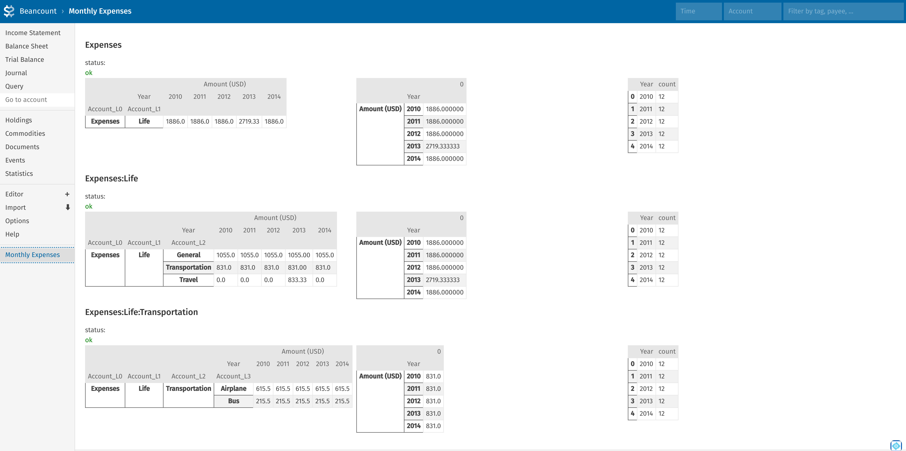

# fava-monthly-expenses

## Screenshot
 
## Get Started
add this line to your main beancount file:

```
2000-01-01 custom "fava-extension" "monthly_expenses" "{'accounts':['Expenses','Expenses:Life','Expenses:Life:Transportation'],'account_used_to_get_valid_month':'Expenses:Life:General'}"
```

`accounts` is the list of the accounts you hope to check in a deeper level.

`account_used_to_get_valid_month` is the account used for calculate number of month should be averaged (for now, months with more than 10 transactions considered valid).

## Credits
Inspred by [beancount-mutiperiod-reports](https://github.com/isabekov/beancount-multiperiod-reports). Thanks.

## Envelope Budget

I like the idea of [Envelope Budgeting](https://www.ynab.com/what-is-a-cash-envelope-system/) a lot.
And I also found [fava-envelope](https://github.com/polarmutex/fava-envelope), which I tried but failed to get working.

I ended up realizing that having the averaged expenses is what I need. I use them to compare my spending with my implicit budget.

So I wrote this, as a simplifed way to implement envelope budget.

